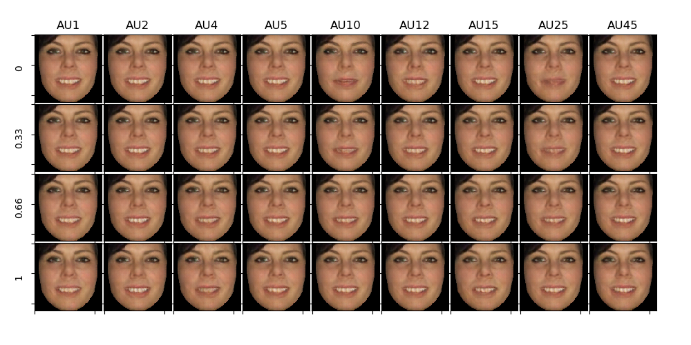

# Facial Unpaired Image-to-Image Translation with (Self-Attention) Conditional Cycle-Consistent Generative Adversarial Networks

Image-to-image translation is the task of changing a particular aspect of a given image to another.
Typical transformations involve hair, age, gender, skin and facial expressions, where recent advances
in GANs have shown impressive results. Facial unpaired image-to-image translation is the task of
learning to translate an image from a domain (e.g. the face images of a person) captured under
an arbitrary facial expression (e.g. joy) to the same domain but conditioning on a target facial
expression (e.g. surprise), in absence of paired examples. The author already obtained good results performing this task adopting FER2013 as dataset. On the other hand, performing error
analysis, it was noticed that, while there are facial expressions like happy vs. sad mutually exclusive,
there are also fuzzier cases like disgust vs. angry where might not be so clearly exclusive. Even for a
human annotator for many of such cases it might not be so clear and, probably, the correct label should
be both. To address this limitation, in this project we improve the model conditioning on Action
Units (AU) annotations, which describe with continuous vectors the anatomical facial movements
defining a human expression. Specifically, although the number of action units is relatively small (30
AU were found to be anatomically related to the contraction of specific facial muscles), more than
7,000 different AU combinations have been observed. For example, the facial expression for fear is
generally produced with activations of Inner Brow Raiser (AU1), Outer Brow Raiser (AU2), Brow
Lowerer (AU4), Upper Lid Raiser (AU5), Lid Tightener (AU7), Lip Stretcher (AU20) and Jaw Drop
(AU26) (1). As a consequence, the target expression is not described by a categorical variable but
by a continuous vector, leading to deep implications. 

**Note: this is an unpaired image-to-image translation problem.**

## Installation
    $ git https://github.com/gtesei/facial_unpaired_i2i_translation_SA_C_CC_GAN
    $ cd facial_unpaired_i2i_translation_SA_C_CC_GAN/
    $ sudo pip3 install -r requirements.txt
    
## Dataset 
We adopt [EmotioNet](https://ieeexplore.ieee.org/abstract/document/7780969), which consists in over 1 million images of facial expressions with associated 
emotion keywords from the Internet and automatically annotated with Action Units (AU). The dataset is re-processed and re-annotated with [OpenFace](https://cmusatyalab.github.io/openface/) to obtain cropped facial images and related AU annotations.

 

Specifically, facial images has been downloaded ([download_images.py](download_images.py)) and re-annotated by using [OpenFace](https://cmusatyalab.github.io/openface/), i.e. 

```bash 
FeatureExtraction -fdir images
```

The expected file system structure under the directory ```datasets``` is here below depicted: 

```
.
+-- datasets 
|  +-- dataFile_1001
|    +-- processed
|      EmotioNet.csv
|      +-- EmotioNet_aligned
|        frame_det_00_000001.bmp
|        frame_det_00_000002.bmp
|        ...
|  +-- dataFile_1002
|      ...
```

Depending on the experiment, we used from 60,000 to 200,000 images. 

Here below, the distribution of a sample of 10,753 images processed with OpenFace. 

 


## Exemplar Results 

### [e8]  Train 
    $ python train_gan_pytorch_4.py
    
    # Defaults
    $ python train_gan_pytorch_4.py \
        -lambda_cl 10 \
        -lambda_cyc 10 \
        -loss_type loss_wasserstein_gp \
        -d_g_ratio 1 \
        -adam_lr 0.0002 \
        -adam_beta_1 0.5 \
        -adam_beta_2 0.999 \
        -epochs 170 \
        -batch_size 32 \
        -sample_interval 1000 \
        -save_interval 1000 \
        -root_data_path datasets \
        -train_size -1 \
        -recover_mode no \
        
    # Usage
    $ python train_gan_pytorch_4.py -h
    
## 60K Train Images 

It takes ~1 day on a AWS p3.2xlarge. 

 

 

    

## 120K Train Images 

It takes ~4 days on a AWS p3.2xlarge. 

 

  

## Experiment Log

Id | Code | Description | Notes | 
--- | --- | --- | --- |
e1 | [Keras] [models_1.py](models_1.py), [train_1.py](train_1.py) | Baseline - Noticed that initialization is a problem. [Epoch 169/170] [Batch 300/10752] [D_gan loss: 7.971193, acc_gan:   0%] [D_AU_loss loss: nan, au_mse: nan] [G_gan loss: 0.000000, G_AU_loss: 00nan, recon: 00nan] time: 0:55:06.274718 -  | adopted [Xavier normal initializization](http://proceedings.mlr.press/v9/glorot10a/glorot10a.pdf).  |
e2 | [Keras] [models_1.py](models_1.py), [train_1.py](train_1.py) | Anyway, this does not solve the problem. Sometime, it can happen that after some batchs the AU critic loss vanishes. [Epoch 0/1000] [Batch 0/336] [D_gan loss: 0.590275, acc_gan:  56%] [D_AU_loss loss: 2.322111, au_mse: 0.204830] [G_gan loss: 0.000000, G_AU_loss: 00nan, recon: 0.466637] time: 0:00:12.726241 [Epoch 0/1000] [Batch 5/10752] [D_gan loss: 7.971193, acc_gan:   0%] [D_AU_loss loss: nan, au_mse: nan] [G_gan loss: 0.000000, G_AU_loss: 00nan, recon: 00nan] time: 0:00:14.490142  | adopted [Xavier uniform initializization](http://proceedings.mlr.press/v9/glorot10a/glorot10a.pdf). But again it does not solve the problem every time |
e3 | [Keras] [train_wgan.py](train_wgan.py) , [models_wgan.py](models_wgan.py) | __Solved the vanishing loss problem of the critic with Wasserstein GAN or [WGAN](https://arxiv.org/abs/1701.07875)__  170 epochs and on a trainset 60,000 images. To train discriminator and the generator, for each train image annotated with AUs , we extract z0 = Genc(x0), and then generate 10 face images conditioning on AUs randomly extracted from Y adding some random noise on active AUs from a uniform random variable U (0.1,0.1) as a trade-off between completely new AUs vs. likely AUs (remember that AU intensities range from 0 to 5). We use mirroring as augmentation method and random shuffle of train data is applied both to generator and discriminator. We use Adam solver with beta1 = 0.5 and beta2 = 0.999, learning rate = 0.0002, batch size of 64, lambda_cyc = 1 and lambda_cd = 2. Despite the relative importance of conditional regression loss is double, we can see that the adversarial loss for the critic and cycle-consistency loss are low compared to the generator's adversarial loss, which suggests the model is more able to reconstruct input images compared to change realistically AUs. We re-trained the model adopting WGAN loss without gradient penalty and results are similar. | Note that our critic is a multi-task learning function, hence we didn't adopt the convolution at the last layer but we flattened to feed the two separate dense layers. 
e4 | [Keras] [train_gan_custom_au_loss.py](train_gan_custom_au_loss.py) | Experimented novel conditional regression lost __log_mean_absolute_error__ | It turns out that modelling the conditional loss as a regression loss has many disadvatages. [OpenFace](https://cmusatyalab.github.io/openface/)  provides both __AUxx_c__, denoting the presence (=1) or absence (=0) of a given AU and __AUxx_r__, denoting the intensity of a given AU (0-5 scale). I noticed that many times for the same AU with AUxx_c active we have low values of AUxx_r intensities or values comparables to AUs with AUxx_c inactive. This suggests me that maybe __AUxx_c__ could be more reliable annotations.           |
e5 | [PyTorch] [train_gan_pytorch.py](train_gan_pytorch.py) , [models_gan_pytorch.py](models_gan_pytorch.py)  | Re-implemted in PyTorch supporting __loss_nonsaturating__ and __loss_wasserstein_gp__. Also, adopted __AUxx_c__  annotations instead of __AUxx_r__. This implies chaning the conditional loss: from regression loss to binary cross-entropy loss. Also, we changed the procedure to sample from the generator. For a given AU vectors (17 dimensional), we consider the 17 vectors obtained complementing one dimension at the time. |  Results are good in terms of reconstructing images but not in terms of changing realistically AUs.  |
e6 | [PyTorch] [models_gan_pytorch_2_bottlenec5x5.py](models_gan_pytorch_2_bottlenec5x5.py) , [train_gan_pytorch_bottleneck5x5.py](train_gan_pytorch_bottleneck5x5.py)  | In the generator instead of having a bottleneck of (512,1,1) we have an 5x5 activation map. Also, the target AU vector is tiled into a 17x5x5 tensor and concatenated before the 1x1 convolution. |  Results are good in terms of recostructing but not in terms of changing realistically AUs.  |
e7 | [PyTorch] [models_gan_pytorch_3.py](models_gan_pytorch_3.py) , [train_gan_pytorch_3.py](train_gan_pytorch_3.py)  | Used same architecture of e6 adding one more convolutional/deconvolutional layer both to the generator and discriminator. |  Results are good in terms of recostructing and also in terms of [changing realistically AUs](https://github.com/gtesei/facial_unpaired_i2i_translation_SA_C_CC_GAN/tree/master/images/success/vers_3).  |
e8 | [PyTorch] [models_gan_pytorch_4.py](models_gan_pytorch_4.py) , [train_gan_pytorch_4.py](train_gan_pytorch_4.py)  | Adopted 128,580 images. [Frechet Inception Distance](FID.py) is computed every 1,000 batches for specific combinations of AUs, i.e. __joy__ (AU06 + AU12), __sadness__ (AU01 + AU04 + AU15), __surprise__ (AU01, AU02, AU05, AU26), __contempt__ (AU12 + AU14). This implementation of Frechet Inception Distance sometime generates fatal errors (e.g. for imaginary component in cov. matrix), hence it was necessary to implement an hot restore procedure for continuing the training loading the last model/training_history saved. |  Results are good in terms of recostructing and also in terms of [changing realistically AUs](https://github.com/gtesei/facial_unpaired_i2i_translation_SA_C_CC_GAN/tree/master/images/success/vers_4_60K).  |


